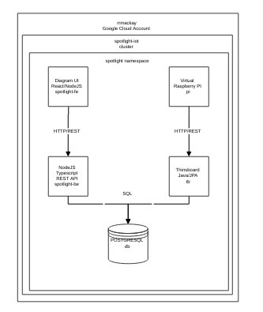

# Spotlight IoT GCP
### Current public URLs on GKE on 2-25-2023
Thingsboard:         http://35.224.156.43:60000/login  http://35.224.156.43:60000/swagger-ui/  
Diagramming Tool:     http://34.70.25.202:63000/  
API Service Doc:      http://35.193.168.243:60008/docs/  

## Diagram 
This is a diagram of this projects deployment structure created using the diagramming tool in this project  



### This project is based on the following hypothetical requirements:
1. Include React diagramming tool as front-end
2. Include nodejS RESTful API back-end from previous project
3. Integrate the ThingsBoard IoT management platform
4. Implement a Raspberry Pi pseudo device in a virtual machine
5. Deploy cluster in docker-compose for local cluster operations
6. Deploy entire project to Google Docker or Kubernetes Engine via Github actions
7. Register a Raspberry Pi DeviceThe log file for this run can be found in the docs directory with timestamp.
8. Read the cluster details and generate a diagram
9. Read the device list from Thingsboard and generate a diagram

The motivation for this project is the merging of 2 separate development projects into a single project and its deployment to a usable state in the GCP. Requirements 6,7 and 8 are nice to have but are optional. This README will include a timeline, task list and screen shots of the progress. 

### Task list and timeline
The file Tasklist.ods is an Open Office spreadhseet with a tab for each day, 

Task List by day: [Thursday](TaskList-23.md)   
Task List by day: [Friday](TaskList-24.md)   
Task List by day: [Saturday](TaskList-25.md)   
Task List by day: [Sunday](TaskList-26.md)   

### Local Kubernetes Deployment to minikube
After working on the environment to configure docker to use the docker provider inside minikube so that local images could be found without reaching out to an image repository the deploy.sh produced the following cluster deployment. Later on in the process we move to the container image registry in github at ghcr.io.

```
kubectl get pods
NAME                            READY   STATUS    RESTARTS   AGE
db-6594c6888-qkdn8              1/1     Running   0          25s
spotlight-be-c898f7587-ffgnv    1/1     Running   0          22s
spotlight-fe-756fb77f6b-bs5xh   1/1     Running   0          24s
tb-5b75dd5884-9tz5f             1/1     Running   0          21s
```
The log file for this run can be found in the docs directory with timestamp.

## DevOps deployment choices
The project has several mechanism to deploy to kubernetes, it does not currently support native deployments to GKE or AWS using non kubernetes descriptors.

### Docker -compose
The project contains a docker-compose.yaml file in the root of the project that includes docker image build functionality for local embedded projects in the fe and be directories. Run the following command in a docker environment.

```
docker-compose up --build
```
Visit localhost:9090 for the Thingsboard login screen. 
visit localhost:8080 for the RESTful API swagger page. 
visit localhost:80 to view the diagram editor.

### Kubernetes
The project contains a kubernetes directory filled with resource descriptor files that create a deployment in a configured Kubernetes environment, the development effort used minikube as the local kubernetes. In the directory there is a deploy.sh script that calls kubectl to deploy the resources files and configure the cluster. 

```
./deploy.sh
./undeploy.sh
minikube service --all
```
Because the default nginx in minikube uses ephemeral ports to receive the access port that is exposed for a given service it will appear after the minikube call. If using an alternate kubernetes engine refer to its documentation to receive access urls.


### Terraform
The project contains a terraform directory that currently contains descriptors to create a usable cluster in GKE based on an existing login session. After the terraform process is applied to GKE you can access the cluster by running additional command listed below to enable kubectl access to the cluster and its resources. You environment may vary from this.

```
terraform plan
terraform apply
gcloud components install gke-gcloud-auth-plugin
sudo apt-get install google-cloud-sdk-gke-gcloud-auth-plugin
gcloud container clusters get-credentials spotlight-iot-gke --region us-central1-a
kubectl config use-context gke_spotlight-iot_us-central1-a_spotlight-iot-gke
kubectl create namespace spotlight
kubectl get pods -n spotlight

```
#### Kubernetes deploy inside Terraform
The current implementation of terraform is not deploying any of the application resources in the kubernetes directory. After the above steps kubectl will be configured to point to the GKE based cluster and the deploy.sh script can be run against it to deploy.

This is the kubectl pod list from the GKE deployment.

```
NAME                            READY   STATUS    RESTARTS   AGE
db-6b448d584-gtrzg              1/1     Running   0          2m14s
spotlight-be-694557f95-n2z72    1/1     Running   0          71m
spotlight-fe-66ff57df9b-j7wbj   1/1     Running   0          71m
tb-84649f7878-jrktr             1/1     Running   0          61s
```

### Github Actions
The docker.yaml file in the workflow folder of .github contains multiple sections, one for each deployed docker container. The containers are upload to ghcr.io using a combination of the repository name and the component initials. spotlight-iot-db as an example. These images are then publicly accessible and can be used for deployment in the configured kubernetes cluster inside GKE.

Github actions is not currently automatically deploying to GKE although the workflow file exists, this is intentional to avoid deployment problems related to repository events.


#### Spotlight REST API Calls  

curl -X GET --header 'Accept: application/json' 'http://35.193.168.243:60008/api/v1/diagram/10'  
curl -X GET --header 'Accept: application/json' 'http://35.193.168.243:60008/api/v1/diagram'  


## External Project references

### Syncfusion Docs
the following url is the repository for embedded syncfusion react ui diagramming tool. 
It is embedded in the project and built separately as the code will be modified to interact with ThingsBoard and the Spotlight REST API eventually. Currently the codebase is the same as in the repo above. Refer to other Spotlight projects for history of shy this library was chosen.  
https://github.com/syncfusion/ej2-showcase-react-diagram-builder

#### Raspberry PI Emulator
The reason behind including a PI emulator is to create a virtual IoT device to register with Thingsboard and deliver telemetry data making a fully functional IoT client/server relationship.  
https://github.com/lukechilds/dockerpi

#### Thingsboard Docs - User Manual
https://thingsboard.io/docs/user-guide
 
#### REST API Ref 
https://demo.thingsboard.io/swagger-ui/#/device-controller/getDeviceCredentialsByDeviceIdUsingGET

#### Python script to provision new device into thingsboard
 https://github.com/eykamp/birdhouse/blob/master/management/provision.py


